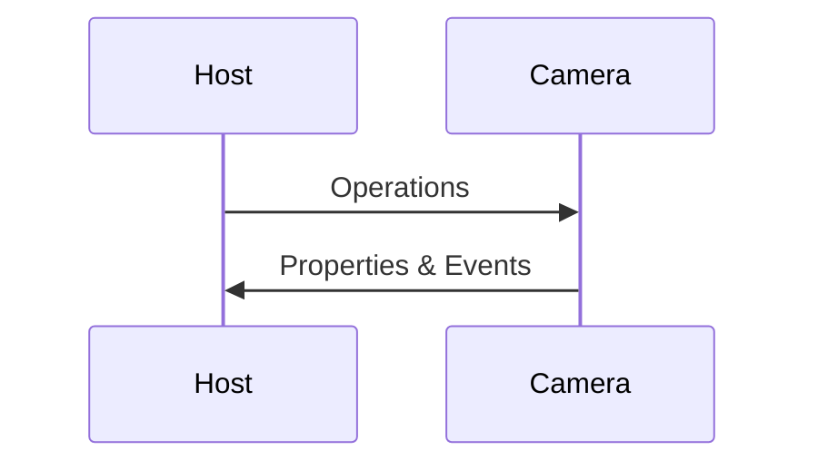
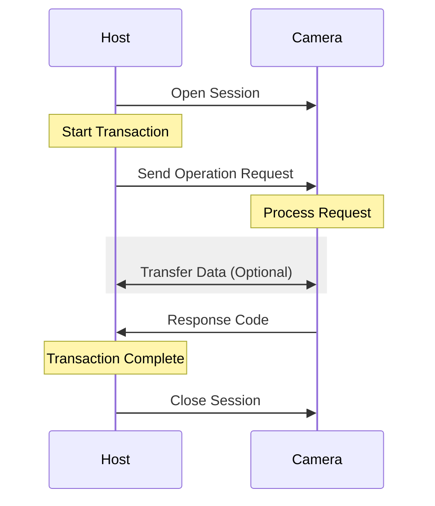

**PTP (Picture Transfer Protocol)** is a standardized protocol for transferring images and controlling digital cameras. PTP has become the foundation for camera communication across most major camera manufacturers.

## History and Standardization

PTP was first introduced in the early 2000s as a replacement for the proprietary protocols that camera manufacturers were using. The protocol was designed to:

- Provide a **standardized way** to communicate with digital cameras
- Enable **remote control** of camera settings and functions
- Facilitate **image transfer** from camera to computer
- Support **event-driven** communication for real-time updates

The protocol was standardized as **ISO 15740:2013**, which defines the core operations, properties, events, and data formats that cameras and host devices use to communicate.

## How PTP Works

PTP operates on a **request-response model** where a host device (like your computer) sends operations to the camera, and the camera responds with data or status information.

The protocol defines several key components, a few examples of which are outlined below.

### Operations

Operations are commands sent from the host to the camera. Common operations include:

- **GetDeviceInfo** - Retrieve information about the camera
- **GetObject** - Download an image or file from the camera
- **GetProperty** - Read a camera setting (ISO, aperture, shutter speed, etc.)
- **SetProperty** - Change a camera setting
- **CaptureImage** - Trigger the camera to take a photo

### Properties

Properties represent camera settings and state. Standard PTP properties include:

- **ExposureIndex** (ISO)
- **FNumber** (Aperture)
- **ExposureTime** (Shutter Speed)
- **WhiteBalance**
- **FocusMode**

### Events

Events allow cameras to notify the host about changes without polling:

- **ObjectAdded** - A new image was captured
- **PropertyChanged** - A camera setting was modified
- **DevicePropChanged** - Device property was updated

## Vendor Extensions

While the original spec provided a starting foundation, most camera manufacturers have extended PTP with vendor-specific operations and properties to support advanced features that might not have been a core focus for still imaging devices with initially limited capabilities in the early 2000s, including:

- Live view streaming
- Video recording
- Granular control over camera functions like white balance, focus, external flashes, etc.

These extensions allow manufacturers to support features beyond the base PTP specification while maintaining compatibility with the core protocol.

## Further Reading

- [ISO 15740:2013](https://www.iso.org/standard/59890.html) - The official PTP specification
- [PTP Reference Documentation](/ptp-reference/property-definitions) - Complete reference for PTP operations, properties, and events
- [Camera API Documentation](/getting_started/camera) - Learn how to use PTP with Darkgrade Fuse
